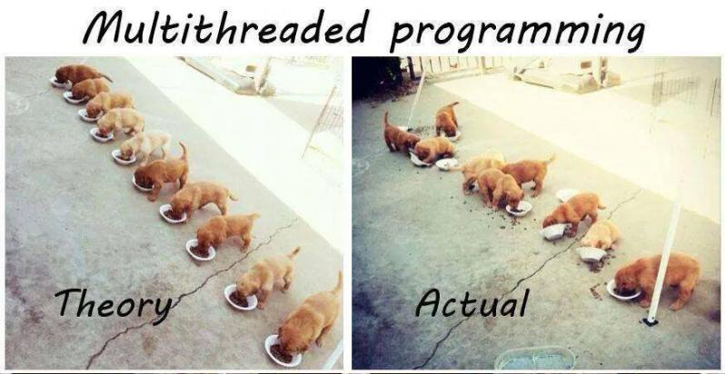

# Project 4



In this project you will implement a FIFO queue as a monitor that can be used to
solve the bounded buffer problem. Your queue will have a fixed capacity and will
block calling threads when it is full or empty. Bounded buffers are extremely
common in Operating Systems. When you write code in Java, Python, C#, etc. it
may seem like you have infinite memory. However, infinite memory is just an
abstraction that the OS provides, in reality you are limited by the physical
hardware the OS is running on.

Your job is to implement a bounded queue that is defined in `lab.h`. Your queue
should be able to have multiple threads adding and removing items without loss
of data or crashing. The provided testing code is setup to allow you to easily
test your implementation. Unit testing multi-threaded code is very difficult so
in this project we will do our testing in main.cpp.You can see all the options
that the testing code gives you with the **-h** flag.

```text
$ ./myprogram -h
Usage: myprogram [-c num consumer] [-p num producer] [-i num items] [-s queue size]
```

## Analysis

Analyze the efficiency of your implementation by examining how adding multiple
producers and consumers compares to just one producer and one consumer. Include
an ASCII histogram in the README.md showing the speedups obtained with varying
number of threads (from 1 to 8) for both producer and consumer. Make sure and
use the same [num items] each time so you can have a good baseline. Please note
the number of cores on the system that you are testing as the hardware can have
dramatic effects on multi-threaded code. You can get the number of cores on the
system with `cat /proc/cpuinfo`.

Don’t make assumptions on what the analysis is supposed to look like! You may be
surprised by the results! Below are some timing results from my solution to help
point you in the right direction. You will need to run your program at least
20-30 times and then **average** the results. If the server is under a lot of
load your values could be impacted which is why you need to have multiple runs!

```text
$ time ./myprogram -c 8 -p 8 -i 10000 -s 100 &>> results.txt
real 0m5.629s
user 0m0.496s
sys 0m0.827s
$ time ./myprogram -c 7 -p 8 -i 10000 -s 100 &>> results.txt
real 0m6.431s
user 0m0.548s
sys 0m1.010s
$ time ./myprogram -c 6 -p 8 -i 10000 -s 100 &>> results.txt
real 0m7.563s
user 0m0.648s
sys 0m1.306s
$ time ./myprogram -c 5 -p 8 -i 10000 -s 100 &>> results.txt
real 0m9.033s
user 0m0.732s
sys 0m1.479s
$ time ./myprogram -c 8 -p 7 -i 10000 -s 100 &>> results.txt
real 0m5.659s
user 0m0.529s
sys 0m0.980s
$ time ./myprogram -c 8 -p 6 -i 10000 -s 100 &>> results.txt
real 0m5.664s
user 0m0.543s
sys 0m1.044s
$ time ./myprogram -c 8 -p 5 -i 10000 -s 100 &>> results.txt
real 0m5.688s
user 0m0.454s
sys 0m0.944s
```

## Race conditions

The hard part about multi threaded programming is sometimes things work even
when the code is horribly broken! Running the code multiple times can sometimes
help to show these errors as shown below. Each example was from the exact same
code base and it produces different results depending on the timing (scheduling)
of the OS level threads.

### Run #1 Error

In this example you can see that due to a race condition in the code somehow the
consumer was able to consume 11 items when the producer only produced 10!
Clearly there is something wrong! In industry this kind of error **only** shows
up on Friday at 4:45pm!

```bash
shane|(master *%>):_solution$ ./myprogram
Creating 1 producers each producing 10 items for a total of 10
Creating 1 consumer threads
Consumer thread: 0x700002d6b000
consuming an item
Producer thread: 0x700002ce8000 - producing 10 items
dequeue: queue is empty!
ACK!! dequeue a NULL item! This should never happen!
consuming an item
consuming an item
consuming an item
consuming an item
consuming an item
consuming an item
consuming an item
consuming an item
consuming an item
Producer thread: 0x700002ce8000 - Done producing!
consuming an item
Consumer Thread: 0x700002d6b000 - Done consuming!
ERROR! Consumer got a null item!
Total produced:10
Total consumed:11
```

### Run #2 Correct

In this run you can see everything works great! This is how the code will run
Monday - Thursday, no issues here!!

```bash
$ ./myprogram
Creating 1 producers each producing 10 items for a total of 10
Creating 1 consumer threads
Producer thread: 0x7000081e2000 - producing 10 items
Consumer thread: 0x700008265000
consuming an item
consuming an item
consuming an item
consuming an item
consuming an item
consuming an item
consuming an item
consuming an item
consuming an item
consuming an item
Producer thread: 0x7000081e2000 - Done producing!
Consumer Thread: 0x700008265000 - Done consuming!
Total produced:10
Total consumed:10
```

## Grad Students (extra credit for undergrad)

After you complete the assignment on Linux using POSIX threads you will need to
port your code to **win32** and use the native windows threading primitives. You
will need to augment your code with pre-processor directives to call the
appropriate function depending on which system you are on. Microsoft provides a
very complete example for you to follow! All you need to do is adapt their
[example](https://docs.microsoft.com/en-us/windows/win32/sync/using-condition-variables)
to your solution.

As an example:

```C
#ifdef __linux__
    //linux code goes here
#leif _WIN32
    // windows code goes here
#else

#endif
```

## Hints

- [pthread tutorial](https://computing.llnl.gov/tutorials/pthreads/)
- [Intro to Threads](http://pages.cs.wisc.edu/~remzi/OSTEP/threads-intro.pdf)
- [Condition Variables](http://pages.cs.wisc.edu/~remzi/OSTEP/threads-cv.pdf)
- [Threads API](http://pages.cs.wisc.edu/~remzi/OSTEP/threads-api.pdf)
- [Locks](http://pages.cs.wisc.edu/~remzi/OSTEP/threads-locks.pdf)
- [Using Locks](http://pages.cs.wisc.edu/~remzi/OSTEP/threads-locks-usage.pdf)
- [Locked Data Structures](https://pages.cs.wisc.edu/~remzi/OSTEP/threads-locks-usage.pdf)
- [POSIX Threads Programming](https://hpc-tutorials.llnl.gov/posix/)

Use a bash script to run your program in a loop to try and produce faults. You
may want to modify the example below to set the command line arguments to random
values to help induce a failure.

```bash
shane|(master *%>):_solution$ while true
do
./myprogram
done
```
